# OonJai - Emergency Reporting & Disaster Relief Web Application

## ภาพรวมโปรเจกต์

พัฒนาระบบเว็บแอปพลิเคชัน **OonJai** สำหรับแจ้งเหตุฉุกเฉินและประสานความช่วยเหลือผู้ประสบภัย โดยรีแฟกเตอร์จากโค้ดเดิมที่กระจัดกระจาย ให้มีโครงสร้างที่ชัดเจน แยก Frontend (ฝั่งผู้ประสบภัย) และ Backend Dashboard (ฝั่ง Admin/Rescue) อย่างเป็นระบบ

### สิ่งที่จะเปลี่ยนแปลงจากโค้ดเดิม

| ปัญหาเดิม | แก้ไขเป็น |
|---|---|
| ไฟล์กระจัดกระจาย (admin/, report_test/, Utils/) | รวมเข้า Next.js App Router อย่างเป็นระบบ |
| ปนกัน JSX/TSX, inline styles | TypeScript เท่านั้น + Tailwind CSS |
| ไม่มีระบบ Auth | Email/Password Auth พร้อม RBAC |
| ไม่มี Database Schema ชัดเจน | MySQL schema ครบ 18 ตาราง |
| Component ไม่แยกหน้าที่ | Clean Architecture แยก component ชัดเจน |

---

## User Review Required

> [!IMPORTANT]
> **MySQL Database**: แผนนี้ใช้ MySQL port 3306 ที่มีอยู่แล้ว (database: `oonjai_system`) ตาม phpMyAdmin ที่แนบมา ผมจะสร้าง migration SQL ให้ทำงานกับตารางทั้ง 18 ตารางที่มีอยู่

> [!IMPORTANT]
> **Google Maps API**: ต้องมี Google Maps API Key สำหรับ Heatmap หากยังไม่มีจะใช้ Leaflet (ฟรี) แทนก่อนได้

> [!WARNING]
> **LINE Messaging API**: ต้องมี Channel Access Token และ Channel Secret จาก LINE Developers Console ผมจะเตรียมโค้ด Webhook ให้พร้อม แต่ต้องใส่ค่า Token จริง

> [!IMPORTANT]
> **ไฟล์ที่จะถูกลบ**: โฟลเดอร์/ไฟล์ที่ไม่จำเป็นจะถูกลบออก:
> - `admin/` (ย้ายเข้า `app/(backend)/`)
> - `report_test/` (ย้ายเข้า component ใหม่)  
> - `Utils/` (ย้ายเข้า `lib/`)
> - `app/oonjai_system/` (ย้ายเข้าโครงสร้างใหม่)
> - `dev` file (ไม่จำเป็น)

---

## Open Questions

> [!IMPORTANT]
> 1. **Google Maps API Key**: มี API Key สำหรับ Google Maps อยู่แล้วหรือไม่? ถ้าไม่มีจะใช้ **Leaflet.js** (ฟรี open-source) แทน
> 2. **LINE Credentials**: มี Channel Access Token และ Channel Secret จาก LINE Developers แล้วหรือยัง?
> 3. **Domain/Port**: Frontend จะรันบน port 3000 (Next.js) และ LINE Webhook (Express) บน port 3001 ตกลงไหม?

---

## โครงสร้างโปรเจกต์ใหม่

```
project-claude/
├── app/                              # Next.js App Router
│   ├── globals.css                   # Design system + Dark mode
│   ├── layout.tsx                    # Root layout
│   ├── page.tsx                      # Landing page
│   │
│   ├── (frontend)/                   # 👤 Victim-facing (Mobile UI)
│   │   ├── layout.tsx                # Layout with BottomNav
│   │   ├── map/page.tsx              # แผนที่
│   │   ├── feed/page.tsx             # ฟีด / ข่าวสาร
│   │   ├── sos/page.tsx              # ปุ่ม SOS
│   │   ├── report/page.tsx           # แจ้งเหตุ (Step Form)
│   │   ├── info/page.tsx             # ข้อมูล
│   │   └── tracking/[id]/page.tsx    # ติดตามสถานะเคส
│   │
│   ├── (backend)/                    # 🛡️ Admin/Rescue Dashboard
│   │   ├── layout.tsx                # Layout with Sidebar
│   │   ├── login/page.tsx            # Sign In
│   │   ├── register/page.tsx         # Sign Up
│   │   ├── dashboard/page.tsx        # Dashboard หลัก
│   │   ├── cases/page.tsx            # จัดการเคส
│   │   ├── cases/[id]/page.tsx       # รายละเอียดเคส
│   │   ├── heatmap/page.tsx          # แผนที่ความร้อน
│   │   ├── news/page.tsx             # จัดการข่าวสาร
│   │   ├── users/page.tsx            # จัดการผู้ใช้ (Admin only)
│   │   ├── report/page.tsx           # สรุปรายงาน + PDF
│   │   ├── ai-trigger/page.tsx       # AI Triage (Admin only)
│   │   └── history/page.tsx          # ประวัติช่วยเหลือ (Rescue only)
│   │
│   └── api/                          # API Routes
│       ├── auth/
│       │   ├── login/route.ts
│       │   └── register/route.ts
│       ├── cases/
│       │   ├── route.ts              # GET all / POST new
│       │   ├── [id]/route.ts         # GET/PUT/DELETE by ID
│       │   └── [id]/status/route.ts  # PUT status update
│       ├── sos/route.ts              # POST SOS emergency
│       ├── dashboard/stats/route.ts  # GET dashboard stats
│       ├── heatmap/route.ts          # GET heatmap data
│       ├── news/route.ts             # CRUD news
│       ├── users/route.ts            # CRUD users
│       ├── report/route.ts           # GET report + PDF
│       ├── ai-triage/route.ts        # POST AI scoring
│       └── line-webhook/route.ts     # LINE Webhook handler
│
├── components/                       # Shared UI Components
│   ├── ui/                           # Base UI components
│   │   ├── Button.tsx
│   │   ├── Card.tsx
│   │   ├── Input.tsx
│   │   ├── Modal.tsx
│   │   ├── Badge.tsx
│   │   ├── Select.tsx
│   │   └── Stepper.tsx
│   ├── frontend/                     # Victim-facing components
│   │   ├── BottomNav.tsx
│   │   ├── TopNavbar.tsx
│   │   ├── SOSButton.tsx
│   │   ├── ReportStepForm.tsx
│   │   ├── StatusTimeline.tsx
│   │   └── FeedCard.tsx
│   ├── backend/                      # Dashboard components
│   │   ├── Sidebar.tsx
│   │   ├── DashboardHeader.tsx
│   │   ├── StatsCard.tsx
│   │   ├── CaseTable.tsx
│   │   ├── CaseDetailModal.tsx
│   │   ├── PieChart.tsx
│   │   ├── SeverityBar.tsx
│   │   ├── HeatmapView.tsx
│   │   ├── ReportForm.tsx
│   │   └── AiTriagePanel.tsx
│   └── shared/                       # Shared across both
│       ├── ThemeToggle.tsx
│       └── LoadingSpinner.tsx
│
├── lib/                              # Utilities & Database
│   ├── db.ts                         # MySQL connection pool
│   ├── auth.ts                       # Auth helpers (hash, verify, JWT)
│   ├── middleware.ts                  # Auth middleware
│   ├── ai-triage.ts                  # AI triage scoring logic
│   └── line.ts                       # LINE API helpers
│
├── line-webhook/                     # LINE Express Server (port 3001)
│   ├── server.ts                     
│   ├── handlers/
│   │   ├── messageHandler.ts
│   │   ├── locationHandler.ts
│   │   └── imageHandler.ts
│   └── package.json
│
├── types/                            # TypeScript types
│   └── index.ts                      # All shared types
│
├── prisma/                           # (เดิมมีอยู่ - จะไม่ใช้, ใช้ mysql2 ตรง)
├── public/                           # Static assets
├── prototype/                        # Reference docs (เก็บไว้)
└── sql/
    └── schema.sql                    # MySQL schema migration
```

---

## Proposed Changes

### Phase 1: Foundation & Database

#### [NEW] [schema.sql](file:///c:/Users/punya/project-claude/sql/schema.sql)
สร้าง MySQL schema สำหรับตารางทั้ง 18 ตาราง ตาม phpMyAdmin ที่แนบมา:

```sql
-- ตารางหลัก
users           -- ผู้ใช้ทั้งหมด (email, password_hash, role: admin/rescue/victim)
cases           -- เคสการช่วยเหลือ (status: wait/accepted/in_progress/completed/cancelled)
sos             -- ข้อมูล SOS ฉุกเฉิน
incidentreport  -- ฟอร์มแจ้งเหตุ
geolocation     -- พิกัด GPS
statusupdate    -- ประวัติการเปลี่ยนสถานะ
rescuer         -- ข้อมูลหน่วยกู้ภัย
victim          -- ข้อมูลผู้ประสบภัย
news            -- ข่าวสาร
ai              -- ผลการคัดกรอง AI
heatmap         -- ข้อมูล heatmap
log             -- ประวัติการใช้งาน
reportform      -- แบบฟอร์มรายงาน
help            -- ข้อมูลการช่วยเหลือ
frontend        -- ข้อมูล frontend config
dispatcher_admin -- ผู้จัดการ/admin
usermanagement  -- จัดการสิทธิ์
```

#### [NEW] [db.ts](file:///c:/Users/punya/project-claude/lib/db.ts)
MySQL connection pool ใช้ `mysql2/promise` เชื่อมต่อ `oonjai_system` database

#### [NEW] [auth.ts](file:///c:/Users/punya/project-claude/lib/auth.ts)
- Password hashing ด้วย bcrypt
- JWT token generation/verification
- Role-based access control (RBAC)

#### [NEW] [types/index.ts](file:///c:/Users/punya/project-claude/types/index.ts)
TypeScript interfaces สำหรับ User, Case, SOSRequest, IncidentReport, etc.

---

### Phase 2: Design System & Shared Components

#### [MODIFY] [globals.css](file:///c:/Users/punya/project-claude/app/globals.css)
สร้าง design system ครบ:
- CSS variables สำหรับ Dark/Light mode
- Color palette: Navy (`#0b1325`), Orange (`#ff6600`), White
- Typography: Inter font
- Utility classes สำหรับ glassmorphism, animations
- Responsive breakpoints

#### [NEW] UI Components (`components/ui/`)
- **Button.tsx**: Primary, Secondary, Danger, Ghost variants + loading state
- **Card.tsx**: Glassmorphism card with hover effects
- **Input.tsx**: Styled input with validation
- **Modal.tsx**: Animated modal overlay
- **Badge.tsx**: Status badges (Wait, In Progress, Completed)
- **Select.tsx**: Custom dropdown
- **Stepper.tsx**: Step indicator for multi-step form

---

### Phase 3: Frontend - Victim-facing Mobile UI

#### [MODIFY] [layout.tsx](file:///c:/Users/punya/project-claude/app/layout.tsx)
Root layout - ลบ DownNav/TopNavbar ออก (ย้ายเข้า route group layout)

#### [NEW] [(frontend)/layout.tsx](file:///c:/Users/punya/project-claude/app/(frontend)/layout.tsx)
Layout สำหรับฝั่งผู้ประสบภัย - มี TopNavbar + BottomNav

#### [NEW] [BottomNav.tsx](file:///c:/Users/punya/project-claude/components/frontend/BottomNav.tsx)
แท็บเมนูด้านล่าง 5 ปุ่ม (ปรับจาก DonwNav.tsx เดิม):
1. 🗺️ แผนที่
2. 📰 ฟีด  
3. 🔔 **SOS** (เด่นที่สุด ยื่นขึ้นมา)
4. 📋 แจ้งเหตุ
5. ℹ️ ข้อมูล

#### [NEW] [SOSButton.tsx](file:///c:/Users/punya/project-claude/components/frontend/SOSButton.tsx)
ปรับจากเดิม:
- Single-touch ดึง Geolocation อัตโนมัติ
- ส่งข้อมูลไปยัง `/api/sos` (แทน PHP เดิม)
- Pulse animation, status feedback (locating → sending → success)
- เพิ่ม vibration feedback

#### [NEW] [ReportStepForm.tsx](file:///c:/Users/punya/project-claude/components/frontend/ReportStepForm.tsx)
ฟอร์มแจ้งเหตุแบบ 2 Steps ตาม prototype:

**Step 1**: ข้อมูลหลัก
- ตำแหน่งปัจจุบัน (auto GPS + แผนที่)
- ชื่อ-นามสกุล, เบอร์โทรศัพท์
- ประเภทผู้ประสบภัย (dropdown)
- จำนวนคน
- ผู้ป่วยติดเตียง (toggle), เด็ก/ผู้สูงอายุ (toggle)
- ระดับน้ำ (dropdown)
- รูปภาพ (แนบไฟล์)
- ข้อมูลเพิ่มเติม

**Step 2**: สรุปข้อมูล + ยืนยัน
- แสดงแผนที่พิกัด + สรุปข้อมูลทั้งหมด
- ปุ่ม "แก้ไขข้อมูล" / "ยืนยันการแจ้งเหตุ"

#### [NEW] [StatusTimeline.tsx](file:///c:/Users/punya/project-claude/components/frontend/StatusTimeline.tsx)
หน้าติดตามสถานะตาม prototype:
- เจ้าหน้าที่รับผิดชอบ (ชื่อ, เบอร์โทร)
- Timeline: รับเรื่องแล้ว → กำลังเดินทาง → กำลังช่วยเหลือ → ช่วยเหลือสำเร็จ
- ปุ่ม "แชร์สถานะ"

---

### Phase 4: Backend - Admin/Rescue Dashboard

#### [NEW] [(backend)/layout.tsx](file:///c:/Users/punya/project-claude/app/(backend)/layout.tsx)
Layout สำหรับ Dashboard - มี Sidebar + Header

#### [NEW] [Sidebar.tsx](file:///c:/Users/punya/project-claude/components/backend/Sidebar.tsx)
Sidebar navigation แยกตาม role:

| เมนู | Admin | Rescue |
|---|:---:|:---:|
| Dashboard | ✅ | ✅ |
| จัดการเคส | ✅ | ✅ |
| แผนที่ Heatmap | ✅ | ✅ |
| ข่าวสาร | ✅ | ✅ |
| รายงาน | ✅ | ✅ |
| จัดการผู้ใช้ | ✅ | ❌ |
| AI Trigger | ✅ | ❌ |
| ประวัติช่วยเหลือ | ❌ | ✅ |

#### [NEW] [login/page.tsx](file:///c:/Users/punya/project-claude/app/(backend)/login/page.tsx)
หน้า Sign In ด้วย Email/Password:
- Dark theme, glassmorphism card
- เลือก role (Admin / Rescue)
- ลิงก์ไป Sign Up

#### [NEW] [register/page.tsx](file:///c:/Users/punya/project-claude/app/(backend)/register/page.tsx)
หน้า Sign Up:
- ชื่อ-นามสกุล, หน่วยงาน, เบอร์โทร, อีเมล, รหัสผ่าน
- เลือก role (Admin / Rescue)

#### [NEW] [dashboard/page.tsx](file:///c:/Users/punya/project-claude/app/(backend)/dashboard/page.tsx)
Dashboard หลัก:
- **Stats Cards**: ช่วยเหลือทั้งหมด, เสร็จสิ้น, รอการช่วยเหลือ
- **Pie Chart**: สัดส่วนทีมกู้ภัย (ใช้ Chart.js)
- **Severity Bar**: แถบแสดงเคสแยกระดับ 1-5
- **Recent Cases**: รายการเคสล่าสุด

#### [NEW] [cases/page.tsx](file:///c:/Users/punya/project-claude/app/(backend)/cases/page.tsx)
ตารางจัดการเคส:
- Filter: Wait / Accepted / In Progress / Completed / Cancelled
- ปุ่ม "รับเคส" (Accept) → เปลี่ยนสถานะเป็น Accepted
- ปุ่ม "นำทาง" → เปิด Google Maps
- ปุ่มดูรายละเอียด → Modal แสดงข้อมูลครบ
- **Admin**: ปุ่ม "ยกเลิกเคส" + กรอกหมายเหตุ
- ปุ่ม "อัปเดตสถานะ" (กำลังช่วยเหลือ / เสร็จสิ้น)
- เมื่อ Completed → เลือกประเมิน: ส่งศูนย์พักพิง / ช่วยเหลือเบื้องต้น / ส่ง รพ.

#### [NEW] [heatmap/page.tsx](file:///c:/Users/punya/project-claude/app/(backend)/heatmap/page.tsx)
แผนที่ความร้อน:
- ดึงพิกัดเคสจาก DB พล็อตบน Google Maps / Leaflet
- สีแดง (severity 5) / ส้ม (3-4) / เขียว (1-2)
- Filter ตามประเภทภัย, ช่วงเวลา

#### [NEW] [report/page.tsx](file:///c:/Users/punya/project-claude/app/(backend)/report/page.tsx)
สรุปรายงาน:
- ฟอร์มสรุปเคสวันนี้ (ดึงจากเคสที่ Completed)
- จำนวนเคสทั้งหมด / ประเภทภัย / ทีมที่ช่วยเหลือ
- **ส่งออก PDF** (ใช้ jsPDF + html2canvas)
- Rescue: บันทึกแล้วส่งข้อมูลไป Admin

#### [NEW] [ai-trigger/page.tsx](file:///c:/Users/punya/project-claude/app/(backend)/ai-trigger/page.tsx)  
**(Admin only)** AI Triage Management:
- ตั้งค่า scoring weights (ระดับน้ำ, จำนวนคน, ผู้ป่วยติดเตียง, etc.)
- ดู queue เคสที่ AI จัดลำดับแล้ว
- Override ลำดับความเร่งด่วนได้

#### [NEW] [history/page.tsx](file:///c:/Users/punya/project-claude/app/(backend)/history/page.tsx)
**(Rescue only)** ประวัติการช่วยเหลือ:
- แสดงเคสที่มีสถานะ Accepted + Completed ของ Rescue คนนั้น
- สรุปจำนวน, เวลาเฉลี่ยต่อเคส

#### [NEW] [news/page.tsx](file:///c:/Users/punya/project-claude/app/(backend)/news/page.tsx)
จัดการข่าวสาร:
- CRUD ข่าว (หัวข้อ, รายละเอียด, รูปภาพ)
- เผยแพร่ไปหน้า Feed ของผู้ประสบภัย

#### [NEW] [users/page.tsx](file:///c:/Users/punya/project-claude/app/(backend)/users/page.tsx)
**(Admin only)** จัดการสิทธิ์:
- ดูรายการผู้ใช้ทั้งหมด
- เปลี่ยน role (admin/rescue)
- ระงับ/เปิดใช้งาน account

---

### Phase 5: API Routes

#### [NEW] API Auth (`app/api/auth/`)
- `POST /api/auth/register` - สมัครสมาชิก (hash password, สร้าง user)
- `POST /api/auth/login` - เข้าสู่ระบบ (verify password, ส่ง JWT token)

#### [NEW] API Cases (`app/api/cases/`)
- `GET /api/cases` - ดึงรายการเคสทั้งหมด (filter by status, severity)
- `POST /api/cases` - สร้างเคสใหม่ (จาก SOS / Report Form / LINE)
- `GET /api/cases/[id]` - ดึงรายละเอียดเคส
- `PUT /api/cases/[id]/status` - อัปเดตสถานะ + Push notification via LINE

#### [NEW] API SOS (`app/api/sos/`)
- `POST /api/sos` - รับ SOS + geolocation → สร้างเคสทันที → AI triage scoring

#### [NEW] API Dashboard (`app/api/dashboard/`)
- `GET /api/dashboard/stats` - สถิติภาพรวม (total, completed, waiting)

#### [NEW] API Others
- `GET /api/heatmap` - ข้อมูลพิกัดสำหรับ heatmap
- CRUD `/api/news` - จัดการข่าวสาร
- CRUD `/api/users` - จัดการผู้ใช้
- `GET /api/report` - ดึงข้อมูลรายงาน
- `POST /api/ai-triage` - คำนวณ AI triage score

---

### Phase 6: AI Triage System

#### [NEW] [ai-triage.ts](file:///c:/Users/punya/project-claude/lib/ai-triage.ts)
Smart Triage Algorithm (Rule-based scoring):

```
Score = (waterLevel × 3) + (peopleCount × 2) + (bedridden × 4) + (elderly × 2) + (severityType × 2)
```

- **ระดับน้ำ**: ต่ำ=1, กลาง=3, สูง=5
- **จำนวนคน**: 1-2=1, 3-5=2, 6-10=3, >10=5
- **ผู้ป่วยติดเตียง**: มี=5, ไม่มี=0
- **เด็ก/ผู้สูงอายุ**: มี=3, ไม่มี=0

ผลลัพธ์: severity 1-5 (1=เฝ้าระวัง, 5=วิกฤต)

---

### Phase 7: LINE Webhook API

#### [NEW] LINE Webhook Server (`line-webhook/`)
Node.js Express server แยกต่างหาก (port 3001):

- รับ **Location Event** → แปลงเป็นเคส SOS
- รับ **Image Message** → บันทึกรูปลง DB
- รับ **Text Message** → ตอบกลับคำแนะนำการใช้งาน
- **Push Message** → อัปเดตสถานะเคสแบบ real-time เมื่อ Rescue เปลี่ยนสถานะ
- **Reply Message** → ตอบกลับยืนยันการรับแจ้งเหตุ

---

### Phase 8: Cleanup & Polish

#### [DELETE] ไฟล์ที่จะลบ
- `admin/` (โฟลเดอร์ทั้งหมด - ย้ายเข้า app/(backend))
- `report_test/` (ย้ายเข้า components)
- `Utils/` (ย้ายเข้า lib/)
- `app/oonjai_system/` (ย้ายเข้าโครงสร้างใหม่)
- `app/Navbar/` (ย้ายเข้า components/)
- `app/sos/` (ย้ายเข้า app/(frontend)/sos/)
- `dev` file

---

## Packages ที่ต้องติดตั้งเพิ่ม

```bash
npm install bcryptjs jsonwebtoken chart.js react-chartjs-2 jspdf html2canvas leaflet react-leaflet
npm install -D @types/bcryptjs @types/jsonwebtoken @types/leaflet
```

| Package | Purpose |
|---|---|
| `bcryptjs` | Hash passwords |
| `jsonwebtoken` | JWT auth tokens |
| `chart.js` + `react-chartjs-2` | Pie chart, bar chart |
| `jspdf` + `html2canvas` | Export PDF reports |
| `leaflet` + `react-leaflet` | Map (ฟรี alternative ของ Google Maps) |

---

## Verification Plan

### Automated Tests
```bash
npm run lint          # ตรวจ ESLint
npm run build         # ตรวจ TypeScript errors + build
```

### Manual Verification
1. **Landing Page**: เปิดดูหน้าแรก มีปุ่ม Sign In/Sign Up
2. **Frontend Flow**: ทดสอบ BottomNav → SOS → Report Form → Status Tracking
3. **Backend Flow**: Sign In → Dashboard → Cases → Accept → Complete → Report
4. **RBAC**: ตรวจว่า Rescue ไม่เห็น AI Trigger, Admin ไม่เห็นประวัติช่วยเหลือ
5. **Dark Mode**: Toggle dark/light mode
6. **API**: ทดสอบทุก endpoint ด้วย curl/Postman
7. **PDF Export**: ส่งออกรายงานเป็น PDF
8. **Database**: ตรวจ data ใน phpMyAdmin หลังทำ operations

---

## ลำดับการพัฒนา

```mermaid
gantt
    title OonJai Development Timeline
    dateFormat X
    axisFormat %s
    
    section Phase 1
    Database Schema + DB Connection    :1, 2
    Auth System (JWT + RBAC)           :2, 3
    TypeScript Types                   :2, 3
    
    section Phase 2
    Design System (CSS)                :3, 4
    UI Components                      :3, 5
    
    section Phase 3
    Landing Page                       :5, 6
    Frontend Layout + BottomNav        :5, 6
    SOS Button                         :6, 7
    Report Step Form                   :6, 8
    Status Tracking                    :7, 8
    
    section Phase 4
    Backend Layout + Sidebar           :8, 9
    Login / Register                   :8, 9
    Dashboard                          :9, 11
    Case Management                    :10, 12
    Heatmap                            :11, 12
    News / Users / Report              :12, 14
    
    section Phase 5
    All API Routes                     :8, 14
    AI Triage                          :12, 13
    
    section Phase 6
    LINE Webhook                       :13, 15
    
    section Phase 7
    Cleanup + Testing                  :15, 16
```


